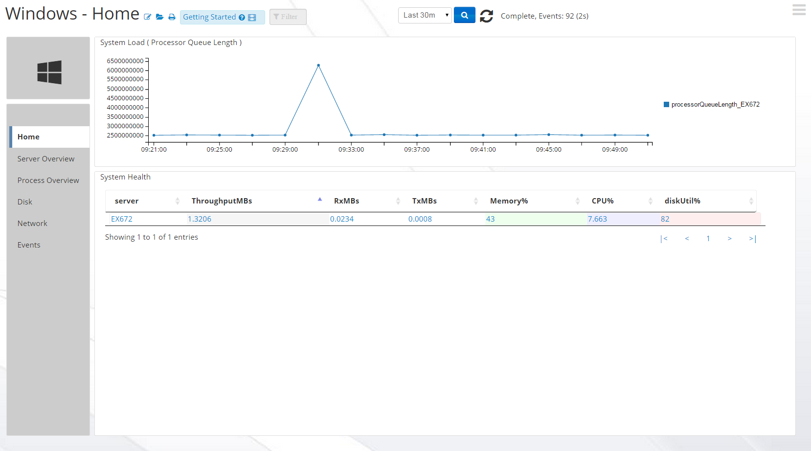
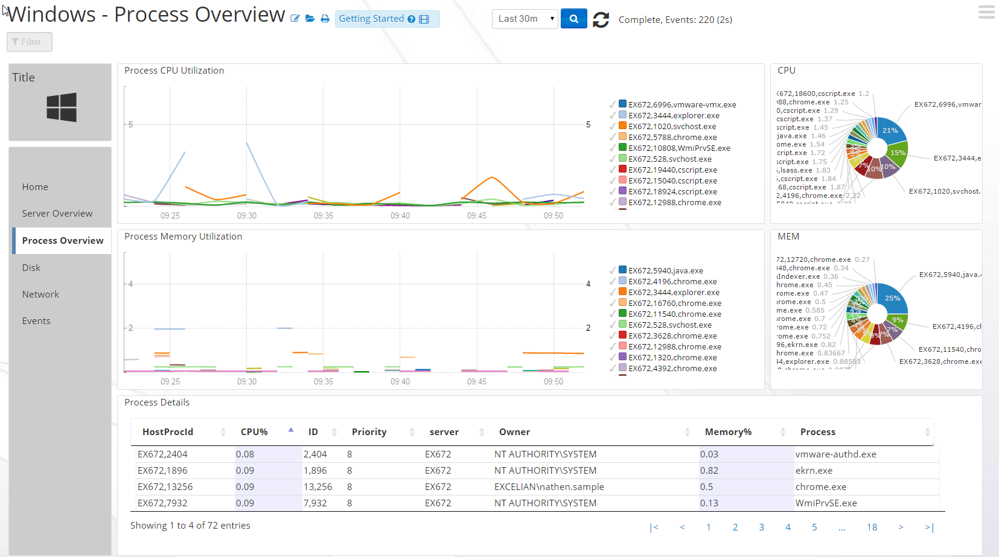
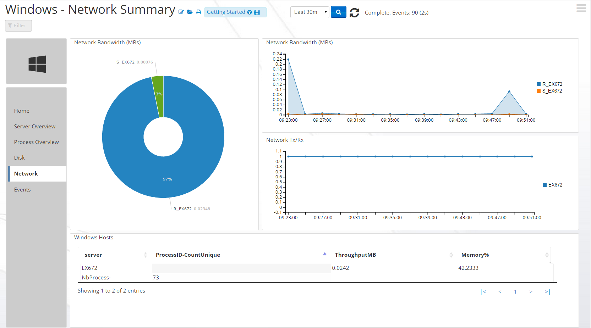
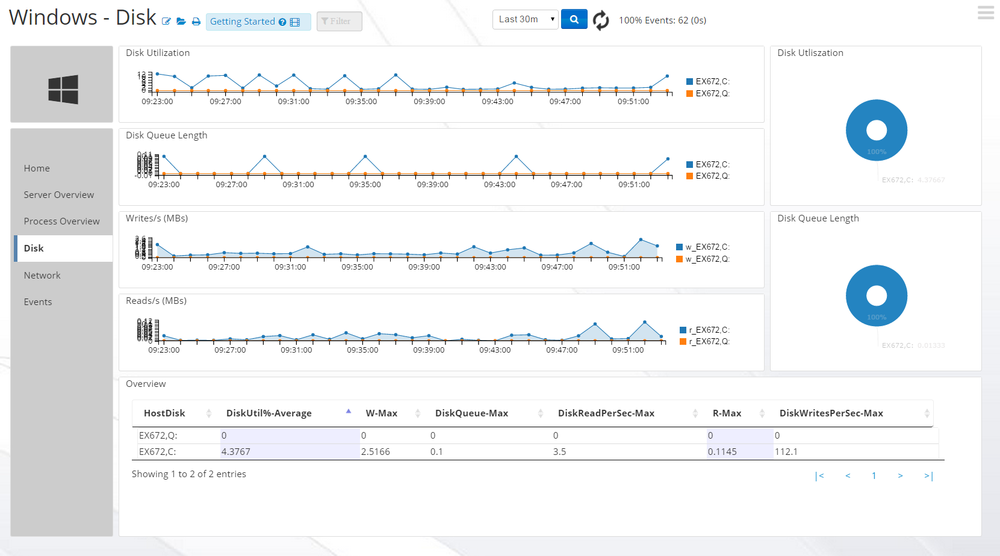
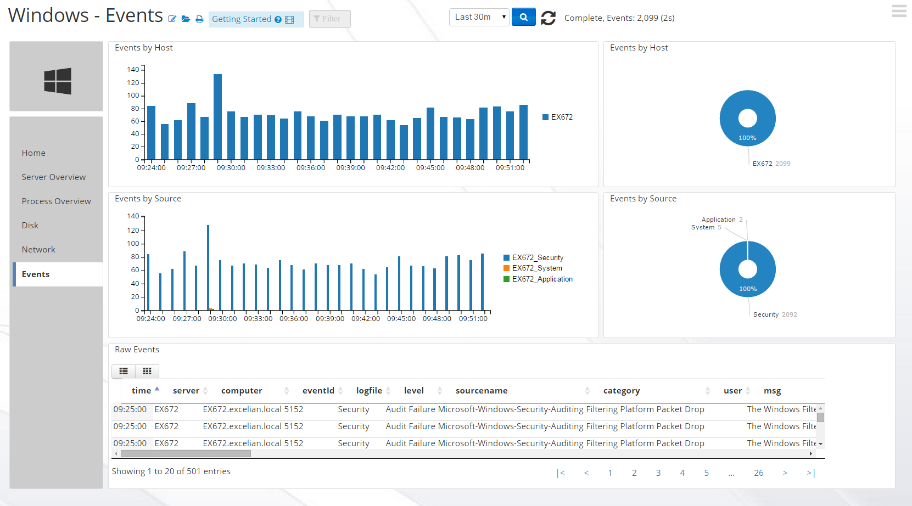

#WindowsApp-1.1

The Logscape App for Windows helps you monitor, search and visualize the health of your Windows  servers. Charts report on system load, memory, network bandwidth and disk performance. 

## Downloads 

 * [WindowsApp-1.1.zip](https://github.com/logscape/cloud-windowsapp/blob/master/WindowsApp-1.1.zip?raw=true)	

## Quick Start

1. Download the zip below and upload it from the deployment page.
2. Download the -override.properties, edit it accordingly to your deployment the override and upload it from the deployment page.
3. Once both are uploaded, press DEPLOY on WindowsApp-1.0.zip (the application, not the override file).
4. The Windows Application is now ready to use and can be selected opening the "Windows Home" Workspace 

# Overview 

The WindowsApp provides dashboards and searches for monitoring Memory,Cpu,Network and Disk Utilization of your Windows Servers. Windows Event Logging is also available from the Event Logs dashboard.  To get access to the WindowsApp home page navigate to the Workspaces and click open, then type 'Windows Home' to locate the Apps home page. The Windows Home will give you an overview your Windows Hosts being monitored and provide a navigation panel on the side other dashboards.

## Process Overview

## Network Overview

## Disk Utilization Overview

## Windows Event Logs 

